# PEP and PDP with Cognito User Pools


## Cost

As this solution is 100% serverless the cost for building and running this tutorial is very low and the cost has a direct correlation to usage. There are no components that cost by the hour, you only pay for what you use / invoke.

## Before you start

The following need to be available on your computer:

* [Install SAM Cli](https://docs.aws.amazon.com/serverless-application-model/latest/developerguide/install-sam-cli.html)

Now, Let's go build!

## Introduction

In this solution we will implement PDP (Policy Decision Point) and a PEP (Policy Enforcement Point). We will build an simple API and use Amazon API Gateway and Lambda Authorizer as the PEP.

For authentication Cognito User Pools will be used. The PDP can be implemented in two different ways, in both we will implement it as a separate Lambda based service.

In the first solution we will use Role Based Access Control (RBAC) and the PDP will keep an mapping between Roles (Cognito Groups) and permissions / access to resources, in DynamoDB.

In the second solution we will also use Role Based Access Control (RBAC), but the PDP will use Amazon Verified Permissions (AVP) to evaluate access and permissions using Roles (Cognito Groups).

The managed UI will be used for Cognito authentication.

For deep dive into this solution read the two existing blogs on the topic.

[Part one - PEP and PDP for Secure Authorization with Cognito](https://jimmydqv.com/pdp-and-pep-in-aws/) 

[Part two - PEP and PDP for Secure Authorization with AVP](https://jimmydqv.com/pdp-and-pep-in-aws-with-avp/)

### Solution overview RBAC with DynamoDB

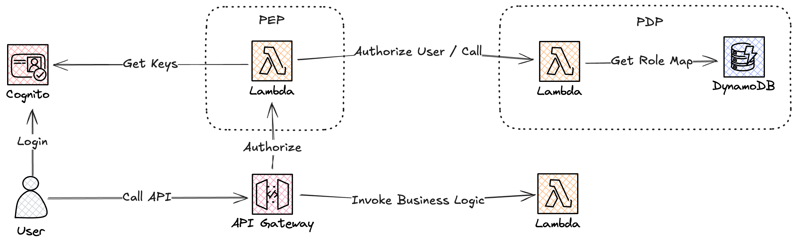

Call Flow:

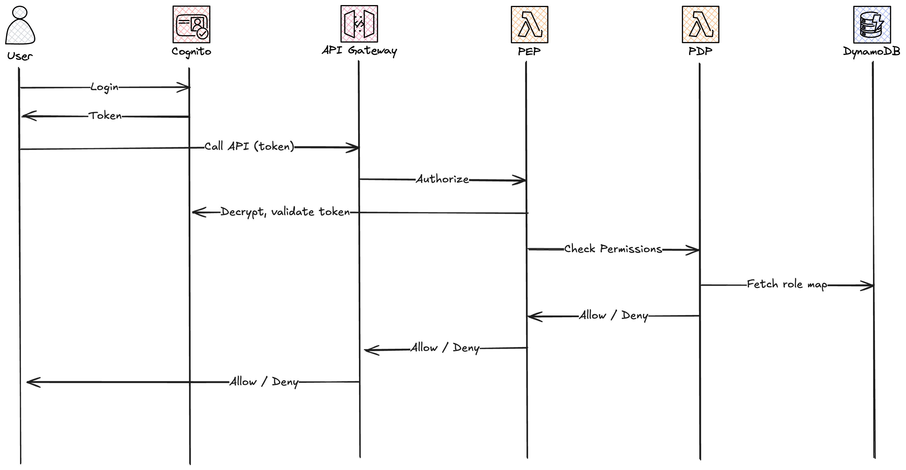

### Solution overview RBAC with AVP

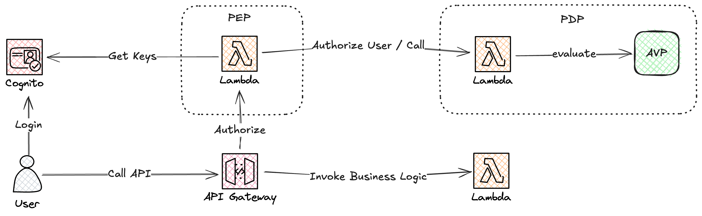

Call Flow:

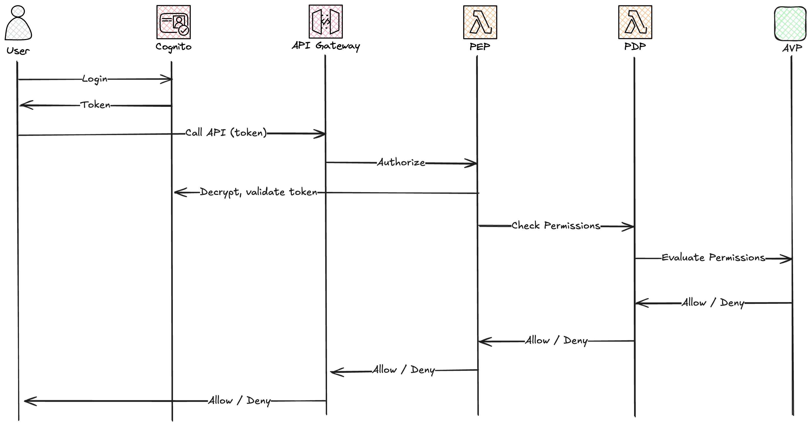

### Solution overview RBAC + ABAC with AVP

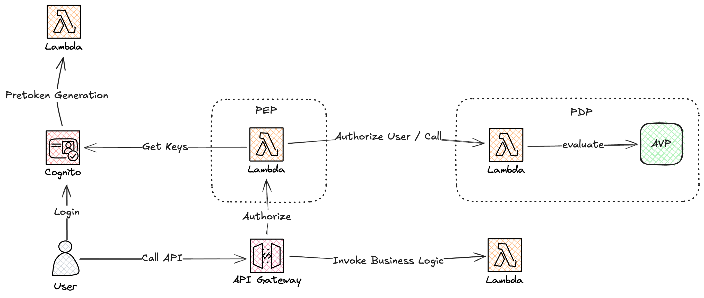

Call Flow:

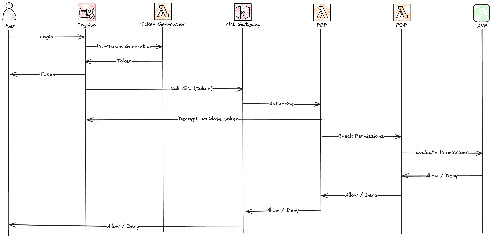

### Cognito callbacks

As we utilize Cognito Managed UI we need to configure some form of webapp that we can set as the callback targets for Cognito. Here we will base this of the solution [Authorization using Lambda@Edge](https://github.com/JimmyDqv/serverless-handbook/tree/main/Solutions/auth-at-cloudfront-edge)

## Configuration Files

Before deploying, you'll need to create and configure the following SAM configuration files. This solution will deploy resources in two regions: eu-west-1 as the main region, and us-east-1 for CloudFront resources.

Replace `dashboard.example.com` with your own custom domain throughout all configurations.

### User Management Configuration

Create `UserManagement/samconfig.yaml`:

```yaml
version: 0.1
default:
  global:
    parameters:
      stack_name: pep-pdp-cognito-user-mgm
      region: eu-west-1
      confirm_changeset: false
      capabilities: CAPABILITY_NAMED_IAM
      s3_prefix: pep-pdp-cognito-user-mgm
      resolve_s3: true
  deploy:
    parameters:
      parameter_overrides:
        - DomainName=your-domain.com
        - ApplicationName=pep-pdp-cognito
        - HostedAuthDomainPrefix=your-auth-prefix
        - UserPoolSecretName=peppdpdemo/UserManagement/UserPoolSecret
```

### Lambda@Edge Functions Configuration

Create `Lambda@Edge/samconfig.yaml`:

```yaml
version: 0.1
default:
  global:
    parameters:
      stack_name: pep-pdp-cognito-auth-lambda-edge
      region: us-east-1
      confirm_changeset: false
      capabilities: CAPABILITY_NAMED_IAM
      s3_prefix: pep-pdp-cognito-auth-lambda-edge
      resolve_s3: true
  deploy:
    parameters:
      parameter_overrides:
        - ApplicationName=pep-pdp-cognito
        - DomainName=your-domain.com
        - HostedZoneId=YOUR_HOSTED_ZONE_ID
        - SecretArn=arn:aws:secretsmanager:eu-west-1:YOUR_ACCOUNT:secret:peppdpdemo/UserManagement/UserPoolSecret-SUFFIX
        - SsmParametersArn=arn:aws:ssm:eu-west-1:YOUR_ACCOUNT:parameter/pep-pdp-cognito/*
```

### SSL Certificate Configuration

Create `SSLCertificate/samconfig.yaml`:

```yaml
version: 0.1
default:
  global:
    parameters:
      stack_name: pep-pdp-cognito-dashboard-ssl-certificate
      region: us-east-1
      confirm_changeset: false
      capabilities: CAPABILITY_NAMED_IAM
      s3_prefix: pep-pdp-cognito-dashboard-ssl-certificate
      resolve_s3: true
  deploy:
    parameters:
      parameter_overrides:
        - ApplicationName=pep-pdp-cognito
        - DomainName=your-domain.com
        - HostedZoneId=YOUR_HOSTED_ZONE_ID
```

### CloudFront Distribution Configuration

Create `CloudFrontDistribution/samconfig.yaml`:

```yaml
version: 0.1
default:
  global:
    parameters:
      stack_name: pep-pdp-cognito-cloudfront-distribution
      region: eu-west-1
      confirm_changeset: false
      capabilities: CAPABILITY_NAMED_IAM
      s3_prefix: pep-pdp-cognito-cloudfront-distribution
      resolve_s3: true
  deploy:
    parameters:
      parameter_overrides:
        - ApplicationName=pep-pdp-cognito
        - DomainName=your-domain.com
        - HostedZoneId=YOUR_HOSTED_ZONE_ID
        - BucketNameSuffix=dashboard-unique-suffix
        - SSLCertificateArn=arn:aws:acm:us-east-1:YOUR_ACCOUNT:certificate/YOUR_CERT_ID
        - SignInFunctionArn=arn:aws:lambda:us-east-1:YOUR_ACCOUNT:function:signin-function:VERSION
        - SignOutFunctionArn=arn:aws:lambda:us-east-1:YOUR_ACCOUNT:function:signout-function:VERSION
        - AuthorizeFunctionArn=arn:aws:lambda:us-east-1:YOUR_ACCOUNT:function:authorize-function:VERSION
        - RefreshFunctionArn=arn:aws:lambda:us-east-1:YOUR_ACCOUNT:function:refresh-function:VERSION
        - IndexPathFunctionArn=arn:aws:lambda:us-east-1:YOUR_ACCOUNT:function:index-function:VERSION
```

### DynamoDB-based PDP Configuration

Create `AuthService/samconfig.yaml`:

```yaml
version: 0.1
default:
  global:
    parameters:
      stack_name: pep-pdp-cognito-pdp-auth-service
      region: eu-west-1
      confirm_changeset: false
      capabilities: CAPABILITY_NAMED_IAM
      s3_prefix: pep-pdp-cognito-pdp-auth-service
      resolve_s3: true
  deploy:
    parameters:
      parameter_overrides:
        - ApplicationName=pep-pdp-cognito
        - UserManagementStackName=pep-pdp-cognito-user-mgm
```

### AVP-based PDP Configuration

Create `AuthServiceAVP/samconfig.yaml`:

```yaml
version: 0.1
default:
  global:
    parameters:
      stack_name: pep-pdp-cognito-pdp-auth-service-avp
      region: eu-west-1
      confirm_changeset: false
      capabilities: CAPABILITY_NAMED_IAM
      s3_prefix: pep-pdp-cognito-pdp-auth-service-avp
      resolve_s3: true
  deploy:
    parameters:
      parameter_overrides:
        - ApplicationName=pep-pdp-cognito
        - UserManagementStackName=pep-pdp-cognito-user-mgm
        - AVPNameSpace=peppdpcognito
        - UserPoolId=YOUR_USER_POOL_ID
```

### API Configuration

Create `API/samconfig.yaml`:

```yaml
version: 0.1
default:
  global:
    parameters:
      stack_name: pep-pdp-cognito-api-service
      region: eu-west-1
      confirm_changeset: false
      s3_prefix: pep-pdp-cognito-api-service
      fail_on_empty_changeset: false
      resolve_s3: true
      capabilities: CAPABILITY_IAM
  deploy:
    parameters:
      parameter_overrides:
        - ApplicationName=pep-pdp-cognito
        - UserManagementStackName=pep-pdp-cognito-user-mgm
        - PDPStackName=pep-pdp-cognito-pdp-auth-service-avp  # Change to pep-pdp-cognito-pdp-auth-service for DynamoDB version
```

## Deploying the solution

### Step 1: Deploy User Management (UserPool)

Update the configuration values in `UserManagement/samconfig.yaml` with your custom domain, then deploy:

``` bash
sam deploy --config-env default --template-file UserManagement/template.yaml 
```

### Step 2: Deploy Lambda@Edge functions

Update the configuration values in `Lambda@Edge/samconfig.yaml` with:
- Your custom domain (same as User Management)
- Your Route53 Hosted Zone ID
- The SecretArn from the UserManagement stack output
- Your AWS account ID in the SsmParametersArn

Deploy using the SAM CLI:

``` bash
sam build
sam deploy --config-env default --template-file Lambda@Edge/template.yaml
```

**Note:** This stack deploys in the `us-east-1` region.

### Step 3: Update Secrets

Update the secrets needed by the Lambda@Edge functions:

1. Navigate to Cognito in the console: UserPool → App Clients → Your App Client
2. Navigate to SecretsManager in the console and open your secret
3. Edit the values with the client ID and secret from Cognito

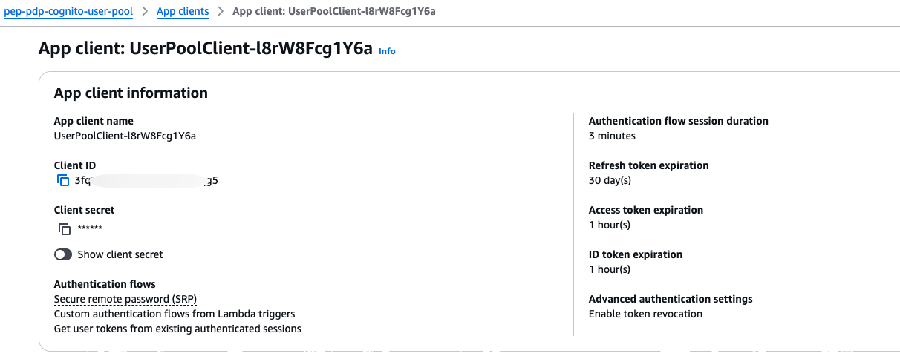
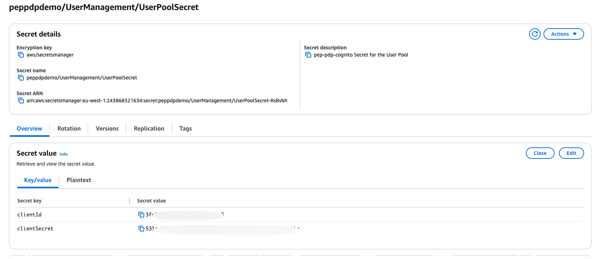

### Step 4: Deploy SSL Certificate

Update the configuration values in `SSLCertificate/samconfig.yaml`, then deploy:

``` bash
sam deploy --config-env default --template-file SSLCertificate/template.yaml
```

**Note:** This stack deploys in the `us-east-1` region.

### Step 5: Deploy CloudFront Distribution

Update the configuration values in `CloudFrontDistribution/samconfig.yaml` with:
- Your custom domain (same as User Management)
- Function ARNs from the Lambda@Edge stack (ensure version is included, e.g. `:1`)
- SSL Certificate ARN from Step 4

Deploy using the SAM CLI:

``` bash
sam deploy --config-env default --template-file CloudFrontDistribution/template.yaml
```

Copy the simple web page to S3 bucket:

``` bash
aws s3 cp Website/index.html s3://YOUR_BUCKET_NAME/index.html
```

### Step 6: Deploy Authorization Service (PDP)

Choose **one** of the following PDP implementations:

#### Option A: DynamoDB-based PDP

Deploy using the SAM CLI:

``` bash
sam build
sam deploy --config-env default --template-file AuthService/template.yaml
```

#### Option B: AVP-based PDP

Update `AuthServiceAVP/samconfig.yaml` with the UserPoolId from Step 1, then deploy:

``` bash
sam build
sam deploy --config-env default --template-file AuthServiceAVP/template.yaml
```

### Step 7: Deploy API

Update `API/samconfig.yaml` and set the `PDPStackName` to point to either:
- `pep-pdp-cognito-pdp-auth-service` (for DynamoDB-based PDP)
- `pep-pdp-cognito-pdp-auth-service-avp` (for AVP-based PDP)

Deploy using the SAM CLI:

``` bash
sam build
sam deploy --config-env default --template-file API/template.yaml
```

## Test the setup

To test the PEP and PDP create a User, Roles, and depending on solution Permission mapping.

### Create User

Navigate to the Cognito UserPool in the Console, click on Users and click `Create User`.
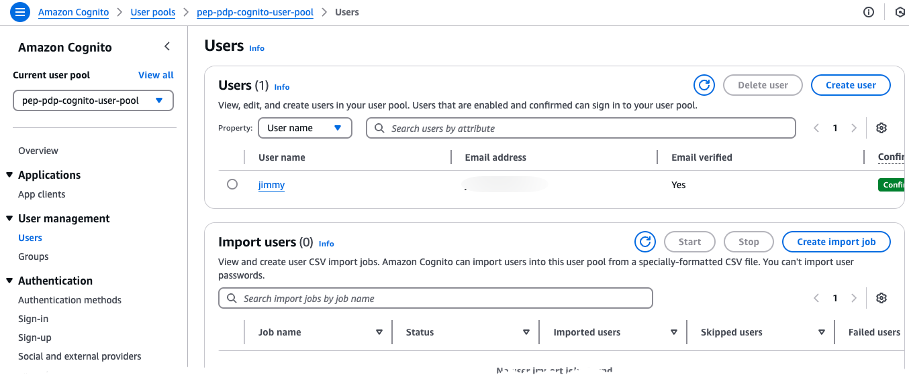

Fill in the values needed, username, password, e-mail make sure to select that the e-mail is verified
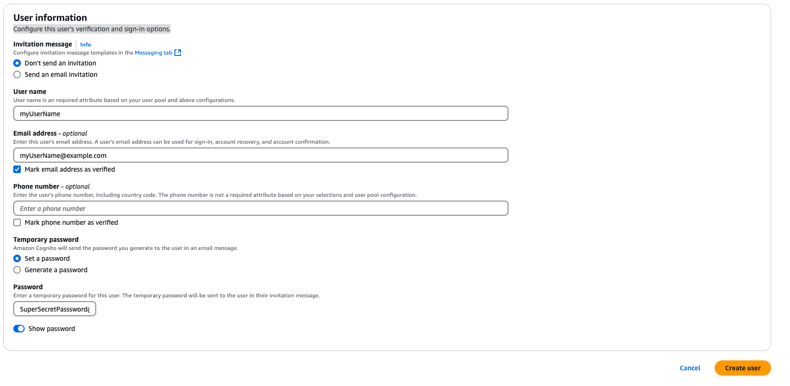

Open a browser and navigate to you custom domain, you should get redirected to Cognito UI, after successful login, click `Show Cookies` to show the JWT tokens.
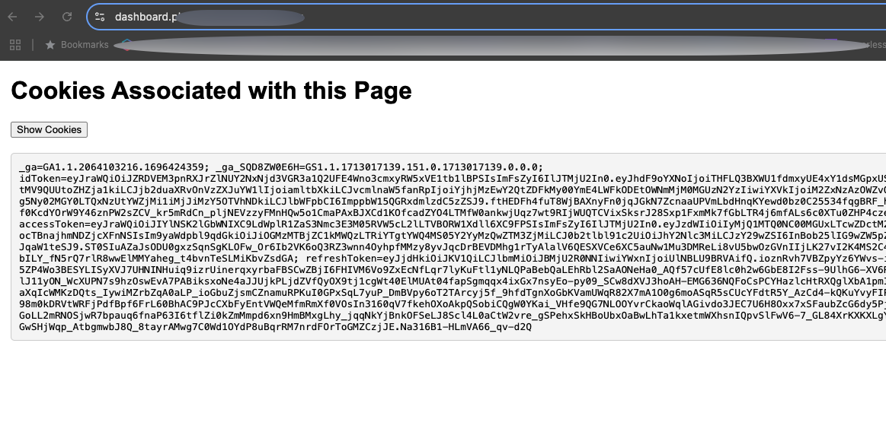

### Create Roles

Navigate to the Cognito UserPool in the Console, click on Groups and click `Create Group`.
Create at least one Group that can match a Role, e.g. `Admin`, `Trainer`, `Rider`
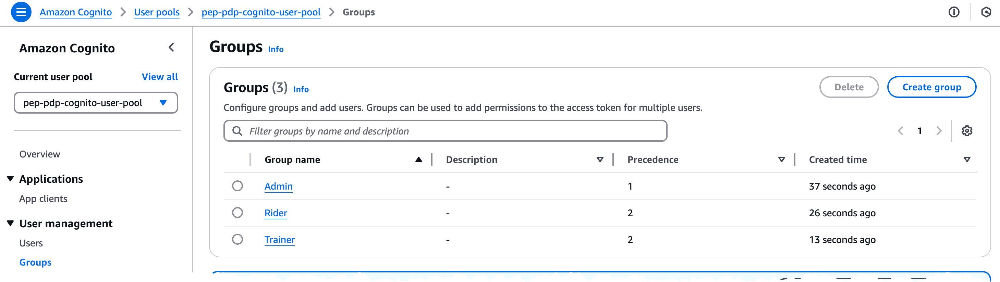

### Assign Role to user

Stay in the Groups section of Cognito UserPool, and click one of the Groups just created.
Click on `Add user to group` and select the created user.
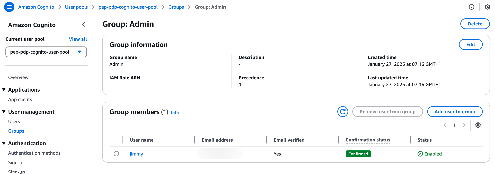

### Add dataAccess attribute to user (ABAC only)

Lorem Ipsum

### Create Permission mapping (DynamoDB based PDP only)

navigate to DynamoDB section of the Console. Locate the permissions table and click on that.
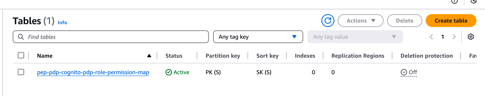

Click on `Explore table items` in the right corner.
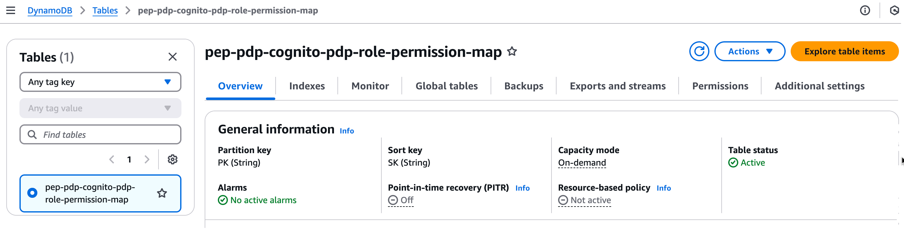

From this view click on `Creat item`
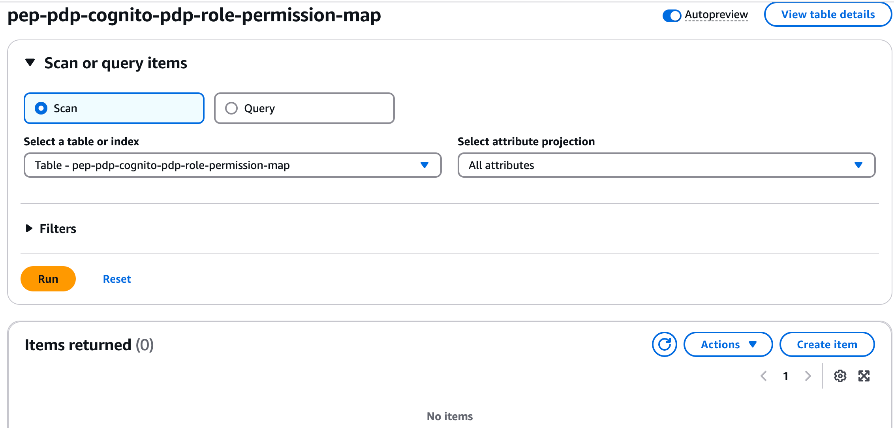

Create a permission mapping, by adding one or several Role - Permission mapping as below.
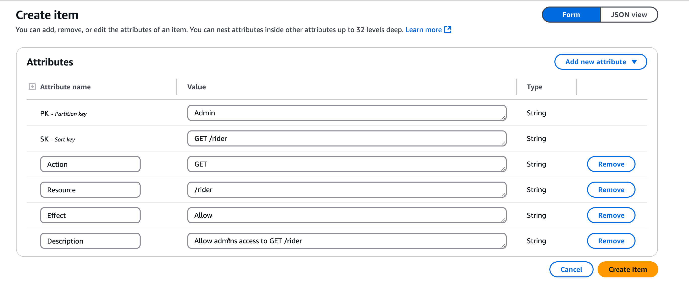

The solution support explicit `Allow`, implicit and explicit `Deny`. Make sure to add at least one allow for the Role assigned to the test user.

### Explore AVP policies (AVP based PDP only)

To explore and test the setup of AVP we can navigate to the AVP part of the console.

Under Policy Stores you should see the policy store that was created for our PDP.

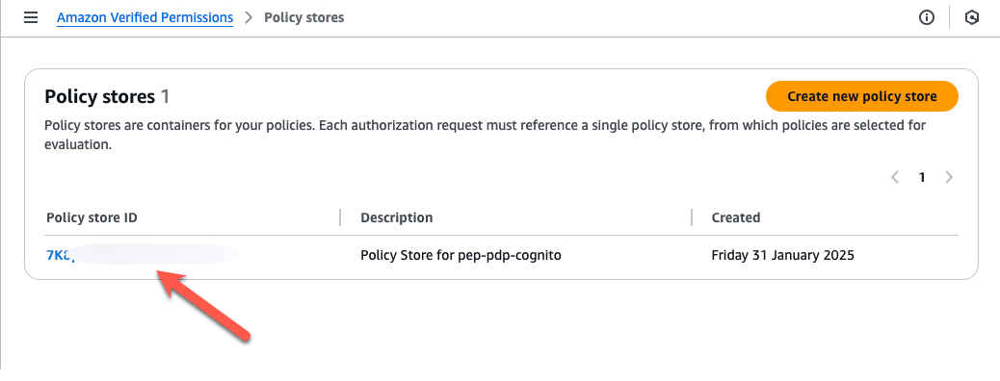

By clicking on the ID of the policy store and selecting `Policies` in the menu we see the list of the three created policies.

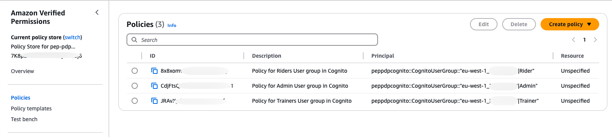

By selecting the Riders policy we can now inspect the create policy.

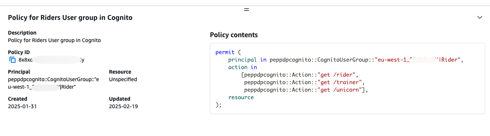

By selecting `Schema` in the menu we can inspect the created schema in a visual form.

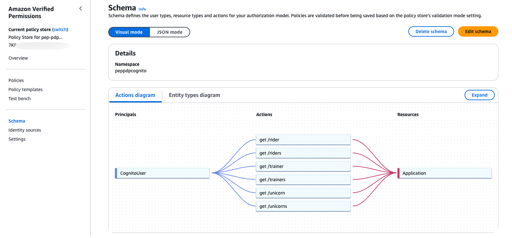

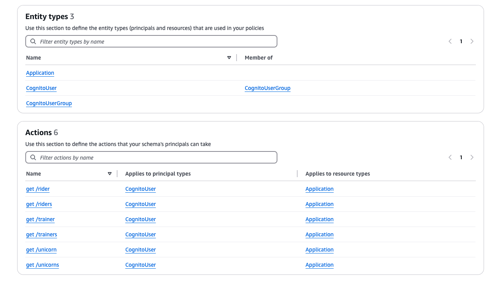

Now, we can navigate to the `Test Bench` to test out our policies, fill in the information as shown in the image below. The group must be prefixed with the Cognito User Pool Id and follow pattern `&lt;COGNITO_USER_POOL_ID&gt;|&lt;GROUP_NAME&gt;`

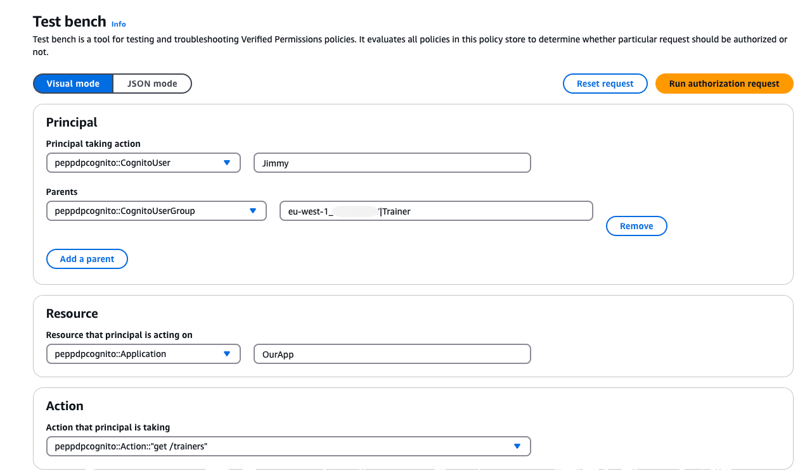

If we select the action `/get trainers` and click `Run Authorization request` we should get a deny back, as the `Trainer` role don't have access to that `Action`

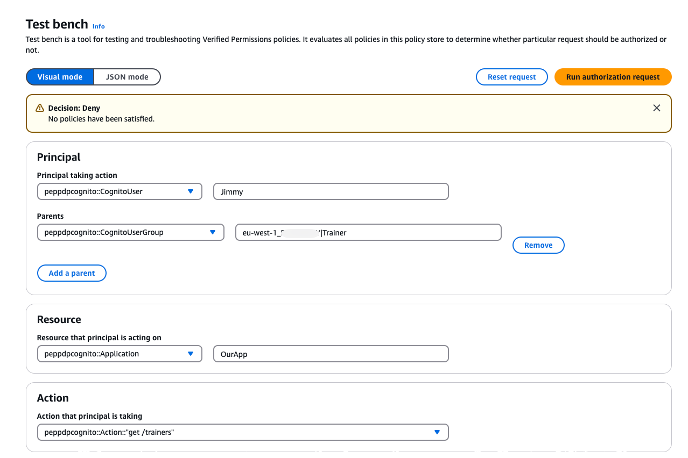

Swapping to the `/get trainer` action should instead give us an allow back.

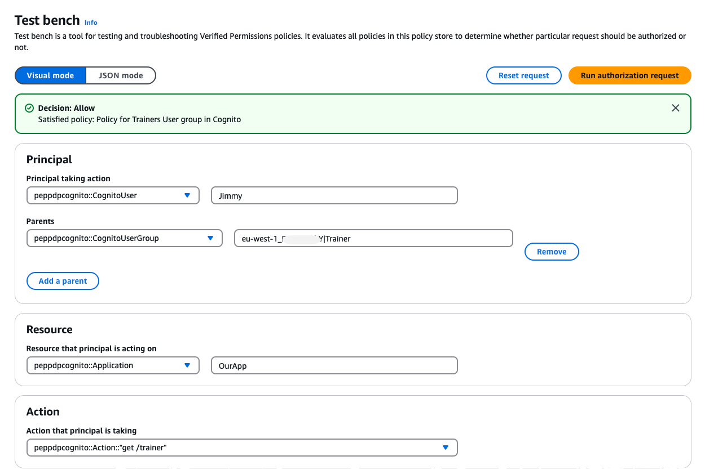

### Call API

Navigate to you favorite API tool such as Postman, Bruno or similar. Make a request to one of the API resources that the test user is `Allow` to view. Make sure to add the `access token` in the `authorization` header. Observe that a correct result is returned.
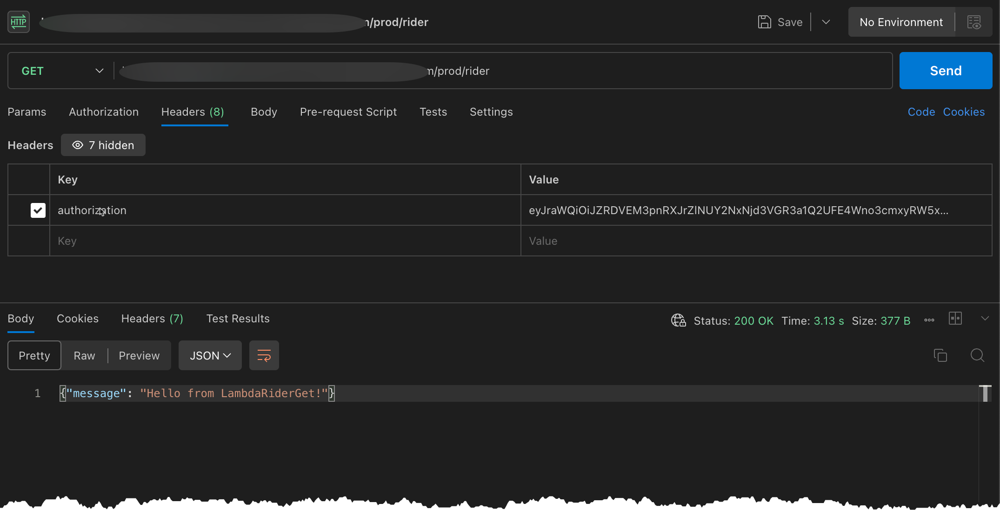

Next make an API call to one of the API resources that the test user doesn't have access to. Observe that a 403 result is returned.
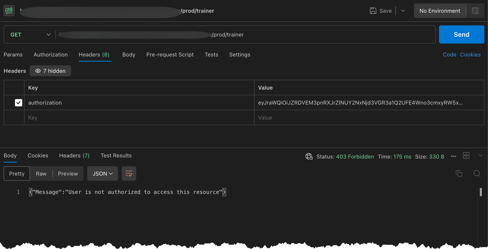

## Clean up

To clean everything up delete the CloudFormation stack. This can be done either with SAM Cli command

``` bash
sam delete --stack-name TEXT
```

Or from the [AWS Console](https://eu-west-1.console.aws.amazon.com/cloudformation/home?region=eu-north-1#/stacks)
