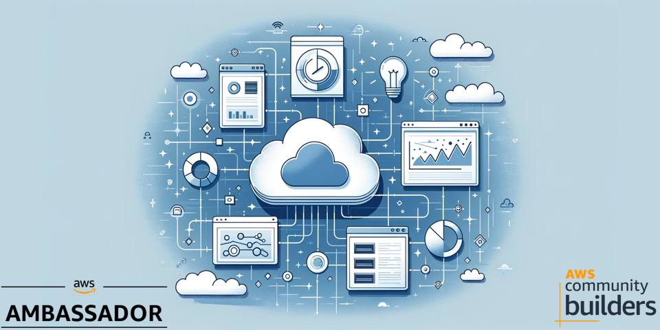
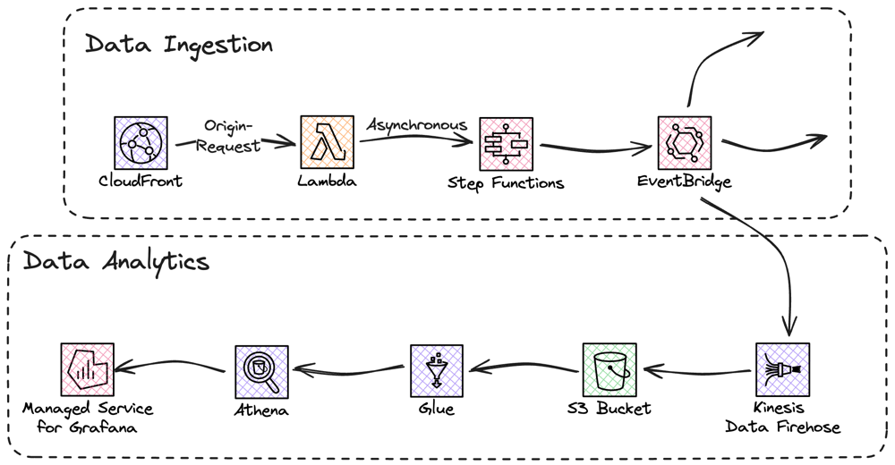

# Serverless statistics solution with Lambda@Edge



In this solution you will build a serverless statistics solution for a static website served from CloudFront. You will use services like Lambda@Edge, StepFunctions, Glue, and Athena.

For a full deep dive visit [my blog post on this topic](https://jimmydqv.com/statistics-with-lambda-at-edge/index.html)

## Cost

As this solution is 100% serverless the cost for building and running this tutorial is very low and the cost has a direct correlation to usage. There are no components that cost by the hour, you only pay for what you use / invoke.

## Before you start

The following need to be available on your computer:

* [Install SAM Cli](https://docs.aws.amazon.com/serverless-application-model/latest/developerguide/install-sam-cli.html)

Now, Let's go build!

## Architecture overview

There are two parts to this overall architecture, the data ingestion and data analytics.



The two parts has been decoupled for easy extension.

Let's start to deploy this solution.

## Configuration Files

Before deploying, you'll need to create and configure the following SAM configuration files:

### US East 1 Lambda@Edge Configuration

Create `us-east-1/samconfig.yaml`:

```yaml
version: 0.1
default:
  global:
    parameters:
      stack_name: serverless-statistics-lambda-edge
      region: us-east-1
      confirm_changeset: false
      capabilities: CAPABILITY_NAMED_IAM
      s3_prefix: serverless-statistics-lambda-edge
      resolve_s3: true
  deploy:
    parameters:
      parameter_overrides:
        - ApplicationName=serverless-statistics
        - StateMachineArn=arn:aws:states:eu-north-1:YOUR_ACCOUNT:stateMachine:YOUR_STATE_MACHINE
```

### EU North 1 Statistics Common Configuration

Create `eu-north-1/Statistics/Common/samconfig.yaml`:

```yaml
version: 0.1
default:
  global:
    parameters:
      stack_name: serverless-statistics-common
      region: eu-north-1  # Change this to your preferred region
      confirm_changeset: false
      capabilities: CAPABILITY_NAMED_IAM
      s3_prefix: serverless-statistics-common
      resolve_s3: true
  deploy:
    parameters:
      parameter_overrides:
        - Application=serverless-statistics
```

### EU North 1 Data Store Configuration

Create `eu-north-1/Statistics/DataStores/s3/samconfig.yaml`:

```yaml
version: 0.1
default:
  global:
    parameters:
      stack_name: serverless-statistics-data-store-s3
      region: eu-north-1
      confirm_changeset: false
      capabilities: CAPABILITY_NAMED_IAM
      s3_prefix: serverless-statistics-data-store-s3
      resolve_s3: true
  deploy:
    parameters:
      parameter_overrides:
        - Application=serverless-statistics
        - StatisticsCommonStackName=serverless-statistics-common
```

### EU North 1 Analytics Configuration

Create `eu-north-1/Statistics/Analytics/samconfig.yaml`:

```yaml
version: 0.1
default:
  global:
    parameters:
      stack_name: serverless-statistics-analytics
      region: eu-north-1
      confirm_changeset: false
      capabilities: CAPABILITY_NAMED_IAM
      s3_prefix: serverless-statistics-analytics
      resolve_s3: true
  deploy:
    parameters:
      parameter_overrides:
        - Application=serverless-statistics
        - S3DataBucketName=serverless-statistics-statistics-data
```

### EU North 1 CloudFront Distribution Configuration

Create `eu-north-1/CloudFrontDistribution/samconfig.yaml`:

```yaml
version: 0.1
default:
  global:
    parameters:
      stack_name: serverless-statistics-cloudfront-dist
      region: eu-north-1
      confirm_changeset: false
      capabilities: CAPABILITY_NAMED_IAM
      s3_prefix: serverless-statistics-cloudfront-dist
      resolve_s3: true
  deploy:
    parameters:
      parameter_overrides:
        - ApplicationName=serverless-statistics
        - BucketNameSuffix=statistics
        - DataIngestlambdaArn=arn:aws:lambda:us-east-1:YOUR_ACCOUNT:function:YOUR_FUNCTION:VERSION
```

## Deployment Steps

### Step 1: Deploy Common Parts in eu-north-1

First deploy the common parts, consisting of StepFunction and EventBridge:

``` bash
sam deploy --config-env default --template-file eu-north-1/Statistics/Common/template.yaml 
```

### Step 2: Deploy Data Store in eu-north-1

Deploy the DataStore with FireHose and S3:

``` bash
sam deploy --config-env default --template-file eu-north-1/Statistics/DataStores/s3/template.yaml 
```

### Step 3: Deploy Lambda@Edge function in us-east-1

Update the `StateMachineArn` in `us-east-1/samconfig.yaml` with the ARN from Step 1, then deploy:

``` bash
sam deploy --config-env default --template-file us-east-1/template.yaml 
```

You will need the full ARN including version for the function in the next steps.

### Step 4: Deploy Analytics in eu-north-1

Deploy the Analytics with Glue and Athena:

``` bash
sam deploy --config-env default --template-file eu-north-1/Statistics/Analytics/template.yaml 
```

### Step 5: Deploy CloudFront Distribution

Update the `DataIngestlambdaArn` in `eu-north-1/CloudFrontDistribution/samconfig.yaml` with the ARN from Step 3, then deploy:

``` bash
sam deploy --config-env default --template-file eu-north-1/CloudFrontDistribution/template.yaml 
```

## Test it

When everything is deployed, you can load a couple of pages from CloudFront, and check that you get data in your S3 bucket.
The crawler is set to run every night, but can be manually invoked, do that to test Athena. First time you use Athena you must set a S3 bucket as query cache.

When that is done you can run queries like this to analyze the data.

``` SQL
select count(*) as visits, "page" from statistics_data where "ViewDate" between '2024-MM-DD' and '2024-MM-DD'  group by "page" order by visits desc
```

## Clean up

To clean everything up delete the CloudFormation stack. This can be done either with SAM Cli command

``` bash
sam delete --stack-name TEXT
```

Or from the [AWS Console](https://eu-west-1.console.aws.amazon.com/cloudformation/home?region=eu-north-1#/stacks)

## Final words

For a full deep dive visit [my blog post on this topic](https://jimmydqv.com/serverless-redirect/index.html)