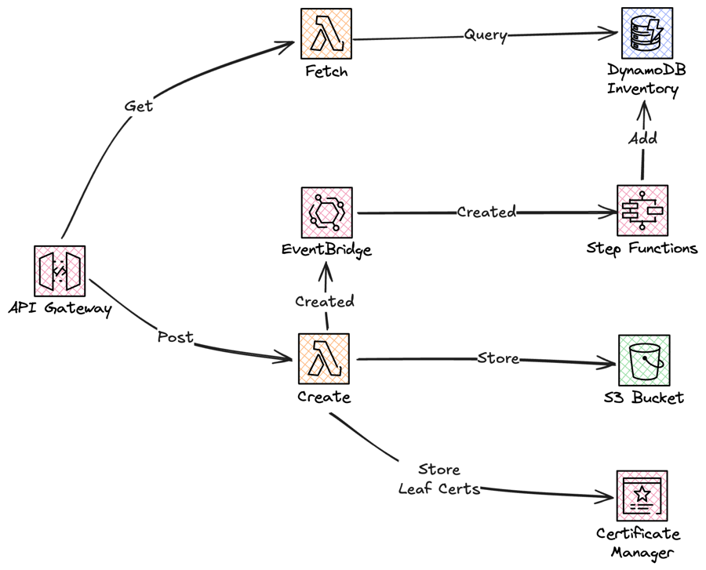

# Serverless Self Service Certificate Management


In this solution you will build a serverless self service certificate management solution.

For a full deep dive visit my blog posts on the topic [Part 1](https://jimmydqv.com/self-service-certs-part-1/index.html), [Part 2](https://jimmydqv.com/self-service-certs-part-2/index.html)

## Cost

As this solution is 100% serverless the cost for building and running this tutorial is very low and the cost has a direct correlation to usage. There are no components that cost by the hour, you only pay for what you use / invoke.

## Before you start

The following need to be available on your computer:

* [Install SAM Cli](https://docs.aws.amazon.com/serverless-application-model/latest/developerguide/install-sam-cli.html)

Now, Let's go build!

## Architecture overview

We will build this completely serverless using Amazon API Gateway and Lambda functions, with storage of the certificates in S3 and Certificate Manager.



Looking the creation flow it would look like this, depending on if it's a CA or leaf (server / client) certificate being created.


## Deploy common infrastructure

First part is to deploy the common infrastructure, containing S3 bucket.

Deploy using the SAM CLI:

``` bash
sam deploy --template-file CommonInfra/template.yaml 
```

## Deploy the API

Next part is to build and deploy the API

Deploy using the SAM CLI:

``` bash
sam build

sam deploy --template-file MalwareScanning/template.yaml 
```
